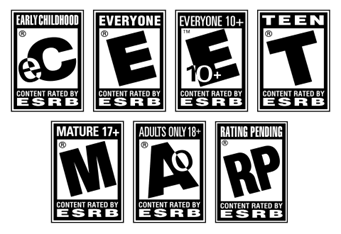

# ESRB Rating Prediction

## Overview
This project aims to predict the Entertainment Software Rating Board (ESRB) ratings of video games using machine learning models. The project explores three different datasets:

- **ESRB Content-Descriptors Dataset:** A dataset that includes content descriptors like violence, alcohol reference, drug reference, etc., directly related to ESRB ratings.
- **Steam Game Descriptions Dataset:** A dataset derived from the Steam API that includes textual descriptions of games.
- **RAWG Game Descriptions Dataset:** A dataset derived from the RAWG API that includes textual descriptions of games, specifically focused on predicting the ESRB rating labels "E" (Everyone), "T" (Teen), and "M" (Mature). This dataset enhances the approach of predicting ESRB ratings based on unstructured game descriptions, offering a broader and potentially more varied set of data.

The goal is to compare the effectiveness of using content descriptors and game descriptions in predicting ESRB ratings and to evaluate the performance of various machine learning models on these datasets.

Additionally, we hope to achieve high accuracy, particularly in predicting content that falls under the Mature (M) rating. Ensuring that M-rated content is accurately identified is critical, as it helps minimize the risk of exposing children to material that may not be suitable for their age group.

## Datasets

### 1. ESRB Content-Descriptors Dataset
- **Source:** [Kaggle Dataset](https://www.kaggle.com/datasets/imohtn/video-games-rating-by-esrb)
- **Features:** Binary indicators for various content descriptors (e.g., violence, blood, drug reference).
- **Target:** ESRB rating labels (E, ET, T, M).

### 2. Steam Game Descriptions Dataset
- **Source:** Data collected using the Steam API.
- **Features:** Textual descriptions of the games.
- **Target:** ESRB rating labels (E, ET, T, M).
- **Note:** This dataset is smaller due to the unavailability of some games on the Steam store.

### 3. RAWG Game Descriptions Dataset
- **Source:** [RAWG API](https://rawg.io/apidocs)
- **Features:** Textual descriptions of the games.
- **Target:** ESRB rating labels (E, T, M).
- **Note:** This dataset provides an enhanced approach to predicting ESRB ratings based on game descriptions, specifically focusing on the rating labels "E", "T", and "M". It is not necessarily related to the previous datasets in terms of distributions or shared titles, offering a fresh perspective on how well models can generalize to different sources of unstructured data.

## Usage

### ESRB Rating Classification
- **Notebook 1:** [`ESRB Rating Classification`](notebooks/esrb_rating_classification.ipynb)
  - **Description:** This notebook covers the ESRB rating prediction based on content descriptors from the Kaggle dataset and compares these results with the same game titles but using their descriptions from the Steam API. It includes all steps from data preprocessing to model evaluation.

- **Notebook 2:** [`RAWG Game Descriptions Classification`](notebooks/game_description-esrb-classification.ipynb)
  - **Description:** This notebook focuses on predicting ESRB ratings using a dataset derived from the RAWG API, which contains game descriptions. The analysis here is dedicated to understanding how well these descriptions can predict the ESRB rating labels "E", "T", and "M".

## Models
The following models were trained and evaluated on all three datasets:

- Logistic Regression
- Decision Tree
- K-Nearest Neighbors (KNN)
- Support Vector Machine (SVM)
- Random Forest

## Test Accuracy Summary

### Steam Game Descriptions Dataset

| Model                  | Vectorizer      | Test Accuracy |
|------------------------|-----------------|---------------|
| Logistic Regression     | TF-IDF          | 48.56%        |
| Logistic Regression     | CountVectorizer | 50.96%        |
| Decision Tree           | TF-IDF          | 46.15%        |
| Decision Tree           | CountVectorizer | 42.79%        |
| K-Nearest Neighbors     | TF-IDF          | 49.52%        |
| K-Nearest Neighbors     | CountVectorizer | 18.75%        |
| Support Vector Machine  | TF-IDF          | 39.90%        |
| Support Vector Machine  | CountVectorizer | 41.35%        |

### RAWG Game Descriptions Dataset (E, T, M Labels Only)

| Model                  | Vectorizer      | Test Accuracy |
|------------------------|-----------------|---------------|
| Logistic Regression     | TF-IDF          | 66.16%        |
| Logistic Regression     | CountVectorizer | 59.49%        |
| Decision Tree           | TF-IDF          | 51.73%        |
| Decision Tree           | CountVectorizer | 48.52%        |
| K-Nearest Neighbors     | TF-IDF          | 37.38%        |
| K-Nearest Neighbors     | CountVectorizer | 42.36%        |
| Support Vector Machine  | TF-IDF          | 68.52%        |
| Support Vector Machine  | CountVectorizer | 65.15%        |
| Random Forest           | TF-IDF          | 35.27%        |
| Random Forest           | CountVectorizer | 65.74%        |

### ESRB Content-Descriptors Dataset

| Model                  | Preprocessing | Test Accuracy |
|------------------------|---------------|---------------|
| Logistic Regression     | PCA           | 81.21%        |
| Logistic Regression     | Original      | 83.72%        |
| Decision Tree           | PCA           | 83.72%        |
| Decision Tree           | Original      | 84.97%        |
| K-Nearest Neighbors     | PCA           | 78.71%        |
| K-Nearest Neighbors     | Original      | 80.17%        |
| Support Vector Machine  | PCA           | 83.92%        |
| Support Vector Machine  | Original      | 85.80%        |

## Insights
- The ESRB Content-Descriptors Dataset yielded better overall predictions due to the direct relevance of the features to ESRB ratings.
- The Steam Game Descriptions Dataset was more challenging due to its indirect relationship with ESRB ratings and the complexity of text data. It also suffered from a smaller dataset size.
- The RAWG Game Descriptions Dataset offers an enhanced approach to predicting ESRB ratings from game descriptions, specifically focusing on the "E", "T", and "M" labels. The dataset's different distributions and title variety provide a valuable comparison to the Steam dataset, highlighting how models generalize to new and varied data sources.
- **TF-IDF** generally led to better generalization in models like Logistic Regression and SVM, particularly in the RAWG dataset, where SVM with TF-IDF achieved the highest test accuracy (68.52%).
- **CountVectorizer** often resulted in higher training accuracy but showed signs of overfitting, particularly in models like Decision Tree and Random Forest.
- The application of PCA in the ESRB Content-Descriptors Dataset generally resulted in slightly lower accuracy compared to the original data, suggesting that feature reduction might not always be beneficial for this type of dataset.

## Potential Improvements
- **Data Augmentation:** Expanding the game descriptions dataset by including more games or using synthetic data could provide more training examples.
- **Model Tuning:** Applying cross-validation, regularization, or ensemble methods might help reduce overfitting and improve generalization.
